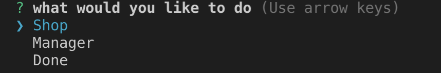
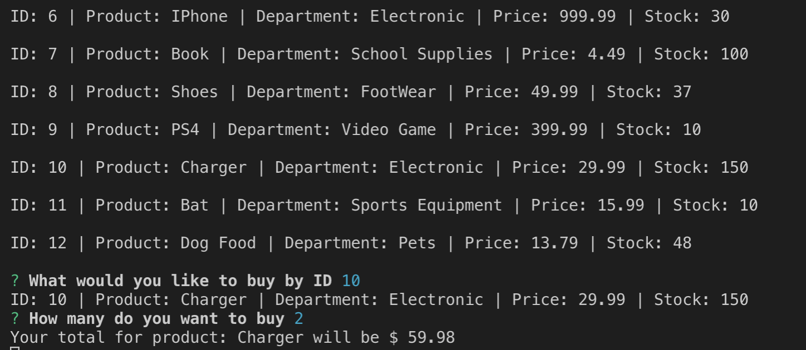

# BamazonDB

BamazonDB uses Mysql and node.js to offer the user a simulated shopping and manager experience.

### The password to access the manager menu is hello

### Installation

You will need a server running and to install the dependencies from the package.js

```bash
npm install
```

### Usage

On your bash terminal preform a node menu.js
```bash
node menu.js
```

Then uses your arrow key to select from the Shop and Manager menu

### Remember the password for the Manager menu is hello

Clicking on the shopper menu will prompt the user to select an item based off there **ID number** and select of much of the product the user would like to purchase. A total would than be printed and the User will be taken back to the original menu.



