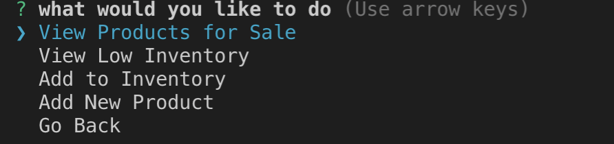
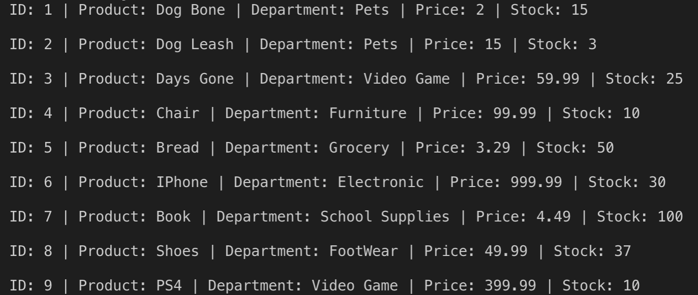
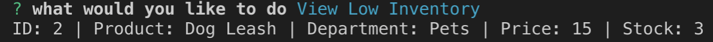
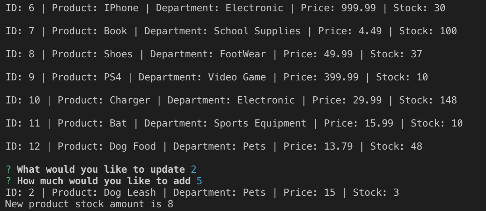
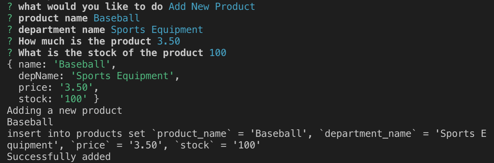

# BamazonDB

BamazonDB uses Mysql and node.js to offer the user a simulated shopping and manager experience.

### The password to access the manager menu is hello

### Installation

You will need a server running and to install the dependencies from the package.js

```bash
npm install
```

### Usage

On your bash terminal preform a node menu.js
```bash
node menu.js
```

Then uses your arrow key to select from the Shop and Manager menu

### Remember the password for the Manager menu is hello

Clicking on the shopper menu will prompt the user to select an item based off there **ID number**. The user will then enter how much of the product they would like to purchase. A total will be printed and the User will be taken back to the original menu.


If the user select the Manager option they will be presented with another menu.



From here they will have the option to view the product.



View Low Inventory "Inventory is considered low if the stock is less than 5"



Add to Inventory, which prompts the user to select a product based off it's **ID number** and select how much of the product they would like to add to inventory



Add New Product, Prompts the user to add the product name, department, price and stock amount of an item they would like to add to inventory



